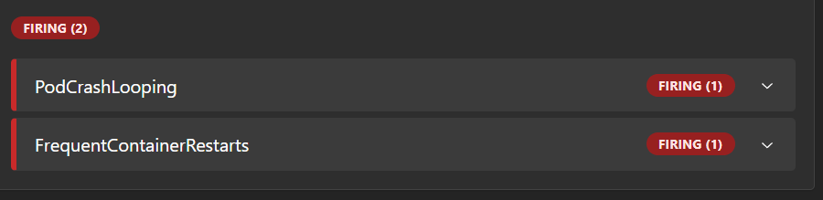
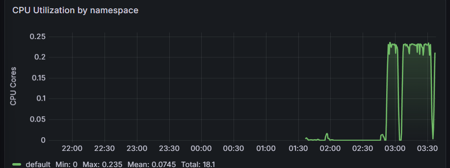
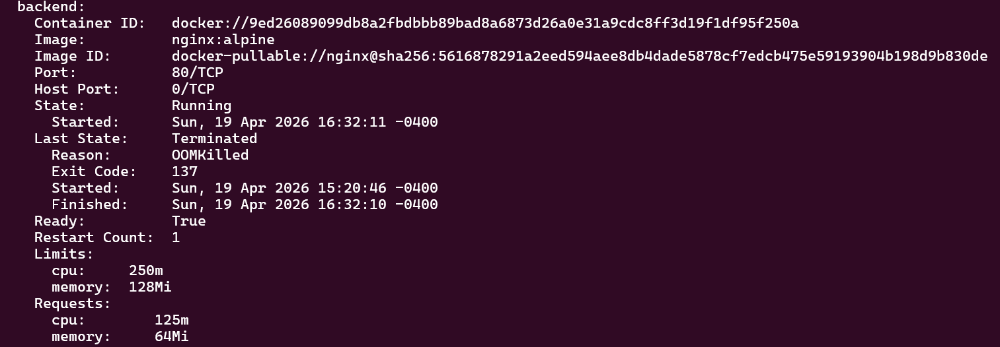

# Kubernetes Monitoring Stack

A production-style observability project demonstrating cluster monitoring, custom alerting, and fault injection on a local Kubernetes cluster.

## Architecture

```
Two-Service Application (Frontend + Backend)
              │
              ▼
    Prometheus (metrics scraping)
              │
              ├── Custom Alert Rules (PromQL)
              │         │
              │         ▼
              │    Alertmanager
              │
              ▼
    Grafana (visualization & dashboards)
              │
              ▼
    Bash Fault Injection Scripts
    (validate alerts fire correctly)
```

## Tech Stack

- **Orchestration:** Kubernetes (Minikube)
- **Monitoring:** Prometheus, kube-prometheus-stack
- **Visualization:** Grafana
- **Package Manager:** Helm
- **Scripting:** Bash

## What This Project Demonstrates

**Cluster Observability:** Prometheus scrapes metrics from every container in the cluster every 15 seconds, storing CPU usage, memory consumption, and restart counts as time-series data.

**Custom Alerting:** Four custom PromQL alert rules detect service degradation and resource exhaustion. Rules use a `for:` duration clause to prevent alert fatigue from transient spikes.

**Fault Injection:** Three Bash scripts deliberately inject failures to validate the alerting infrastructure — simulating CrashLoopBackOff, OOMKill memory exhaustion, and CPU throttling.

**Infrastructure as Code:** The entire application layer is defined declaratively in YAML manifests. The monitoring stack is deployed via Helm with a single command.

## Screenshots

### CrashLoop Alerts Firing


### CPU Spike in Grafana


### OOMKill Evidence


## How to Run

**Prerequisites:** Docker, Minikube, kubectl, Helm installed.

**Start the cluster:**
```bash
minikube start --driver=docker --cpus=4 --memory=4096
```

**Deploy the application:**
```bash
kubectl apply -f app.yaml
kubectl get pods  # wait for Running
```

**Install the monitoring stack:**
```bash
helm repo add prometheus-community https://prometheus-community.github.io/helm-charts
helm repo update
kubectl create namespace monitoring
helm install prometheus-stack prometheus-community/kube-prometheus-stack \
  --namespace monitoring \
  --set prometheus.prometheusSpec.podMonitorSelectorNilUsesHelmValues=false \
  --set prometheus.prometheusSpec.serviceMonitorSelectorNilUsesHelmValues=false
```

**Apply custom alert rules:**
```bash
kubectl apply -f alert-rules.yaml
```

**Access the UIs (run in separate terminals):**
```bash
# Prometheus
kubectl port-forward svc/prometheus-stack-kube-prom-prometheus -n monitoring 9090:9090

# Grafana
kubectl port-forward svc/prometheus-stack-grafana -n monitoring 3000:80
```

- Prometheus: `http://localhost:9090`
- Grafana: `http://localhost:3000` (username: `admin`)

**Run fault injection scripts:**
```bash
chmod +x simulate_crashloop.sh simulate_oomkill.sh simulate_cpu_spike.sh

# Simulate CrashLoopBackOff
./simulate_crashloop.sh

# Simulate OOMKill memory exhaustion
./simulate_oomkill.sh

# Simulate CPU throttling
./simulate_cpu_spike.sh
```

## Alert Rules

| Alert | Condition | Severity |
|---|---|---|
| `PodCrashLooping` | Pod restart rate exceeds threshold over 15 minutes | Critical |
| `FrequentContainerRestarts` | Container restart count exceeds 1 | Warning |
| `ContainerHighMemoryUsage` | Memory usage above 90% of limit | Warning |
| `ContainerHighCPUUsage` | CPU usage above 80% of limit for 1 minute | Warning |

## Key Concepts

**Why resource limits matter:** Memory limits are enforced hard by the Linux kernel — exceeding them triggers an OOMKill (Exit Code 137). CPU limits are enforced softly through throttling — the container stays running but gets paused periodically by the kernel's Completely Fair Scheduler.

**Alert fatigue prevention:** The `for:` duration clause in each rule requires the condition to persist continuously before firing. This prevents momentary spikes from triggering false alarms.

**The Prometheus Operator pattern:** Alert rules are defined as Kubernetes custom resources (PrometheusRule). The Operator watches for these resources and automatically reconfigures Prometheus without requiring a restart.

## Project Structure

```
k8s-monitoring/
├── app.yaml                  # Frontend + backend deployments and services
├── alert-rules.yaml          # Custom PrometheusRule definitions
├── simulate_crashloop.sh     # Fault injection: CrashLoopBackOff
├── simulate_oomkill.sh       # Fault injection: OOMKill memory exhaustion
├── simulate_cpu_spike.sh     # Fault injection: CPU throttling
└── README.md
```